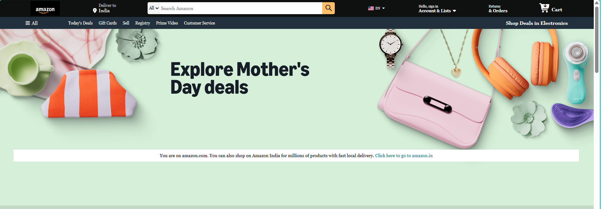
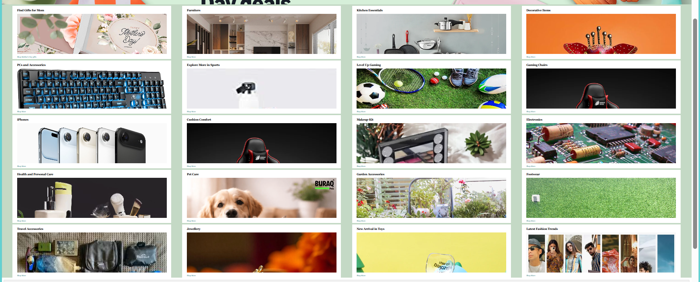
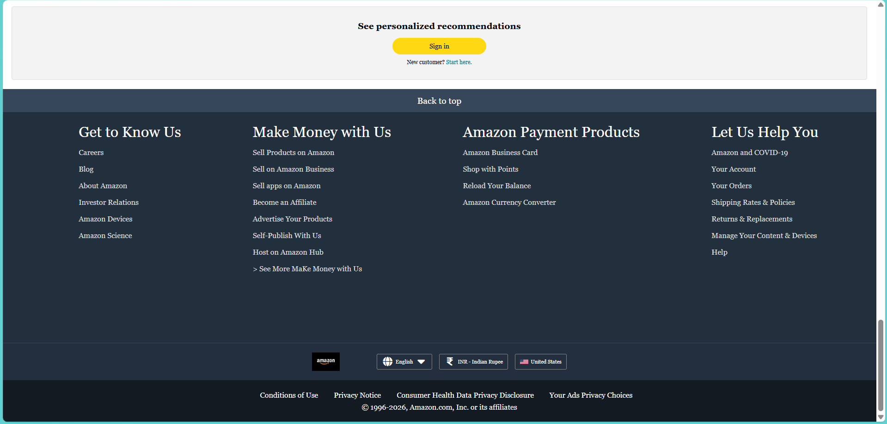

# Amazon Clone — Frontend Practice Project


> A pixel-faithful clone of the Amazon.com homepage — built with pure HTML5 and CSS3. No frameworks. No JavaScript. Just fundamentals.

---

## 🔗 Live Preview

>  **[View Live Demo]( https://tusharr-mishra.github.io/amazon-clone-website/)** 

---

## 📸 Screenshots

| Section | Preview |
|--------|---------|
| Navbar + Hero |  |
| Product Cards |  |
| Footer |  |

---

## Features

-  Fully responsive navbar with search bar, cart, and account links
-  Sub-navigation panel with category shortcuts
-  Full-width hero banner section
-  20 product category cards in a responsive flex grid
-  Multi-column footer with links, locale selectors, and copyright bar
-  Hover effects on navbar items, search bar, buttons, and links
-  Amazon-accurate color scheme (#0F1111, #febd68, #131A22)
-  Font Awesome icons throughout

---

## Tech Stack

| Technology | Badge | Usage |
|-----------|-------|-------|
| HTML5 |  | Page structure and semantic markup |
| CSS3 |  | All layout, colors, hover effects, and responsiveness |
| Font Awesome 7 |  | Icons (cart, location pin, search, flags) |
| Git |  | Version control |
| GitHub |  | Code hosting |
| VS Code |  | Code editor |
| Google/CDN images |  | Product card thumbnails |

---

## Folder Structure

```
project3_clone_website/
├── index.html          # Main HTML file
├── style.css           # All styles
├── amazon-logo.png     # Logo image (navbar + footer)
├── hero-section.png    # (Optional local hero image)
└── screenshots/        # Add your screenshots here
```

---

## What I Learned

This project was a hands-on deep-dive into core frontend concepts:

- **Flexbox layout** — Used extensively across the navbar, search bar, product grid, and footer to align and distribute elements
- **`flex-wrap: wrap`** — Allows product cards to automatically flow to the next row, creating a responsive grid without media queries
- **`box-sizing: border-box`** — Ensures padding and borders don't break the intended element sizes
- **`background-size: cover`** — Makes images fill containers cleanly without stretching or distorting
- **`rem` units** — Font sizes in `rem` scale relative to the root, making text more predictable and responsive
- **Hover effects & transitions** — Used `border`, `background-color`, and `transition` to create smooth interactive feedback
- **CSS specificity** — Understood the difference between `.parent:hover` and `.parent :hover` (descendant combinator)
- **Reusable utility classes** — `.border` applied to multiple nav items avoids repetition

---

## Challenges Faced

- **Aligning navbar items perfectly** — Getting all elements to sit at the same vertical center required careful use of `align-items: center` and `justify-content: space-evenly`
- **Search bar layout** — Building the three-part search bar (select + input + icon) as a single flex row with correct sizing and border-radius
- **Inline `background-image` syntax** — Product card images use inline `style` attributes; quotes inside the URL value needed careful handling (`url('...')` inside `style="..."`)
- **Footer column height** — Making all four footer columns stay the same height without content overflow

---

## Future Improvements

- [ ] Add JavaScript for a working cart counter
- [ ] Make the site fully responsive using CSS media queries for mobile screens
- [ ] Add a sticky navbar that stays visible on scroll
- [ ] Implement a working search bar with filter functionality
- [ ] Add a product detail page

---

## How to Run Locally

No setup needed — just open it in your browser!

```bash
# Clone the repository
git clone https://github.com/your-username/amazon-clone.git

# Open the project
cd amazon-clone

# Open index.html in your browser
# On macOS:
open index.html

# On Windows:
start index.html

# Or just double-click index.html in your file explorer
```

> **Note:** The Amazon logo requires `amazon-logo.png` to be present in the project root. If the logo doesn't appear, make sure the file exists alongside `index.html`.

---

## About This Project

This project was built as a **frontend learning exercise** to practice and solidify core HTML and CSS skills. It is not affiliated with or endorsed by Amazon.com in any way. All Amazon branding, logos, and design elements are the property of Amazon.com, Inc.

The goal was to replicate the visual structure of the Amazon homepage as closely as possible using **only HTML and CSS** — no JavaScript frameworks, no CSS libraries, no shortcuts.

---

## Connect

If you found this helpful or have feedback, feel free to connect!

- GitHub: [@your-username](https://github.com/tusharr-mishra)
- LinkedIn: [Your Name](https://linkedin.com/in/tusharr-mishra)

---

*Built with 💛 for frontend practice — one `div` at a time.*
